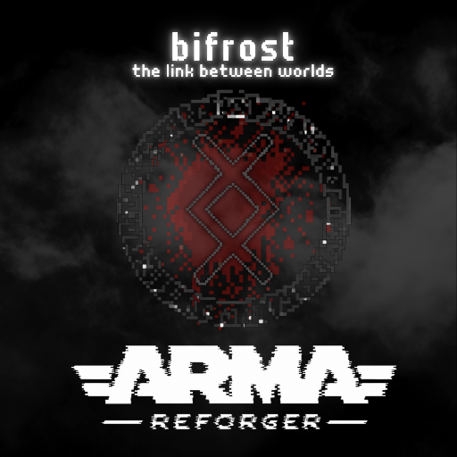

# Bifrost

  

Bifrost is an unofficial community addon and is not affiliated with or endorsed by Bohemia Interactive.

Bifrost is an Arma Reforger Game Master addon focused on a compact operational interface, faster scenario editing, and effects controls.

## Current scope

- CREATE, EDIT, ORDERS, SCENARIO, GAMEPLAY, and OPTIONS surfaces
- Searchable placement catalog and full-screen loadout editor
- Precise move/rotate tools, snapping, attachment, visibility, simulation, and stance controls
- Scenario presets, time/date controls, weather, side relations, and budget readouts
- GM-directed group orders and scenario tools, including formations, ambush, defence, QRF, and building clearing
- Placeable triggers, tracer and explosion emitters, mortar effects, flybys, gunruns, and loitering aircraft
- GM overlays, nametags, awareness cues, map tools, notifications, chat feed, tutorial, and performance readout

## Installation

Open the project in Arma Reforger Workbench or install the published addon through the normal game distribution channel. Bifrost depends only on Arma Reforger data.

## Release state

Current release: **1.0.29**. GitHub source is prepared for the operator's Bohemia Workshop upload under addon GUID `6A0C2D6CE9809C6E`. Compilation and static replication review passed; dedicated-server, remote-client, join-in-progress, and final UI testing remain with the operator. See [release evidence and upload handoff](docs/RELEASE_1.0.29.md) and [docs/TESTING.md](docs/TESTING.md).

## License and credits

Bifrost's original code and content are released under the [Arma Public License Share Alike (APL-SA)](LICENSE.txt). Bifrost is non-commercial, Arma-only material. Third-party assets remain under their respective licenses and are documented in [CREDITS.md](CREDITS.md) and [THIRD_PARTY_NOTICES.md](THIRD_PARTY_NOTICES.md).
